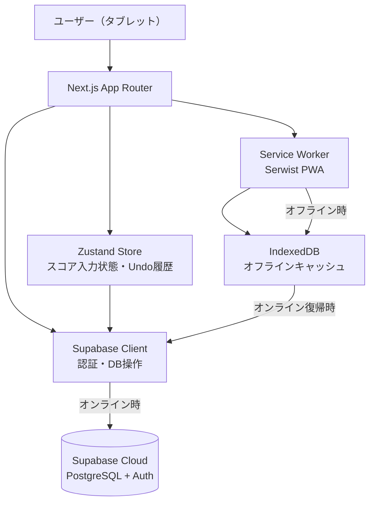
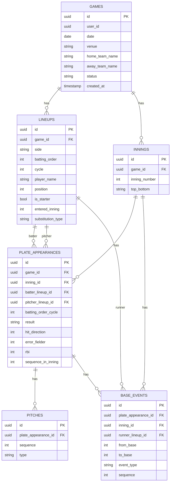
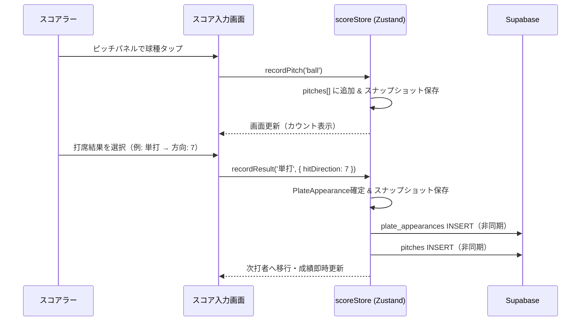
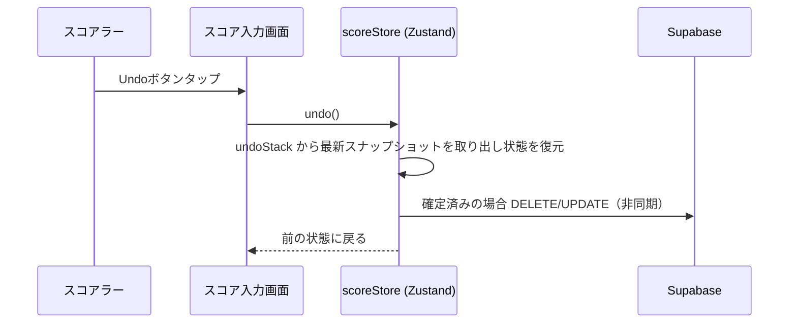
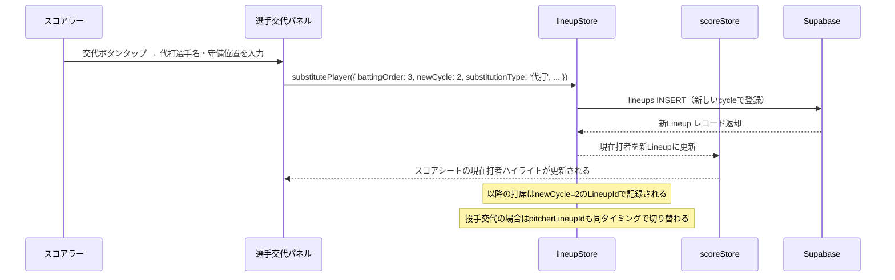
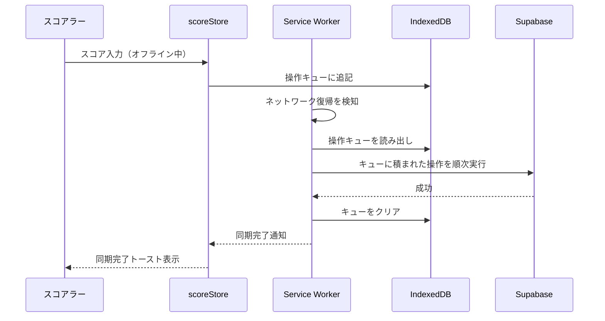
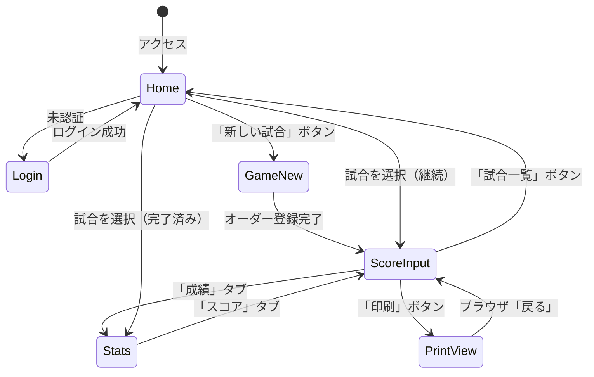

# 機能設計書 (Functional Design Document)

## システム構成図



## 技術スタック

| 分類 | 技術 | 選定理由 |
|------|------|----------|
| フレームワーク | Next.js 15 (App Router) | SSR/SSGとクライアント操作の両立、ルーティング、印刷ビュー分離 |
| 言語 | TypeScript 5.x | 型安全なスコアブックデータ管理、IDEサポート |
| スタイリング | Tailwind CSS + shadcn/ui | タブレット向けレスポンシブUI、既製コンポーネント活用 |
| 状態管理 | Zustand | 軽量でシンプル。スコア入力状態とUndo履歴の管理に適合 |
| バックエンド/DB | Supabase (PostgreSQL + Auth + RLS) | 認証・RLS・リアルタイム同期をワンストップで提供 |
| PWA | Serwist | Service Worker管理、オフラインキャッシュ戦略 |
| パッケージマネージャー | npm | プロジェクト標準 |

---

## データモデル定義

### エンティティ: Game（試合）

```typescript
interface Game {
  id: string;             // UUID
  userId: string;         // 所有者（Supabase auth.uid()）
  date: string;           // 試合日（YYYY-MM-DD）
  venue?: string;         // 球場名（任意）
  homeTeamName: string;   // ホームチーム名
  awayTeamName: string;   // ビジターチーム名
  status: GameStatus;     // 'in_progress' | 'completed'
  createdAt: string;      // ISO 8601
  updatedAt: string;      // ISO 8601
}

type GameStatus = 'in_progress' | 'completed';
```

**制約**:
- `userId` はRLSにより `auth.uid()` と一致するもののみアクセス可能
- `homeTeamName`, `awayTeamName` は必須（1〜50文字）

---

### エンティティ: Lineup（打順・選手）

```typescript
interface Lineup {
  id: string;                         // UUID
  gameId: string;                     // FK → games.id
  side: 'home' | 'away';             // ホーム/ビジター
  battingOrder: number;               // 打順（1〜9）
  cycle: number;                      // 打者一巡サイクル（1〜、同じ打順の2人目以降は2）
  playerName: string;                 // 選手名
  position: FieldingPosition;         // 守備位置（1〜9）
  isStarter: boolean;                 // 先発かどうか
  enteredInning?: number;             // 途中出場時のイニング番号
  substitutionType?: SubstitutionType; // 交代種別
}

type FieldingPosition = 1 | 2 | 3 | 4 | 5 | 6 | 7 | 8 | 9; // 投捕一二三遊左中右
type SubstitutionType = '代打' | '代走' | '守備交代' | '投手交代';
```

**制約**:
- 同じ `gameId` + `side` + `battingOrder` + `cycle` の組み合わせは一意
- 先発選手は `cycle = 1`, `isStarter = true`

---

### エンティティ: Inning（イニング）

```typescript
interface Inning {
  id: string;                         // UUID
  gameId: string;                     // FK → games.id
  inningNumber: number;               // イニング番号（1〜、延長対応）
  topBottom: 'top' | 'bottom';        // 表/裏
}
```

---

### エンティティ: PlateAppearance（打席）

```typescript
interface PlateAppearance {
  id: string;                         // UUID
  gameId: string;                     // FK → games.id
  inningId: string;                   // FK → innings.id
  batterLineupId: string;             // FK → lineups.id（打者）
  pitcherLineupId: string;            // FK → lineups.id（投手）
  battingOrderCycle: number;          // 打順サイクル
  result?: PlateResult;               // 打席結果（入力完了後にセット）
  hitDirection?: FieldingPosition;    // 打球方向（守備番号1〜9）
  errorFielder?: FieldingPosition;    // エラーした守備番号
  rbi: number;                        // 打点（0〜）
  sequenceInInning: number;           // イニング内の打席順序（1〜）
}

type PlateResult =
  | '単打' | '二塁打' | '三塁打' | '本塁打'   // 安打
  | 'ゴロ' | 'フライ' | 'ライナー'             // アウト（打球性）
  | '三振振り' | '三振見'                      // 三振
  | '犠打' | '犠飛'                            // 犠打・犠飛
  | '四球' | '死球'                            // 出塁
  | '野選' | 'エラー' | '併殺打' | '振り逃げ'; // その他
```

---

### エンティティ: Pitch（投球）

```typescript
interface Pitch {
  id: string;                   // UUID
  plateAppearanceId: string;    // FK → plate_appearances.id
  sequence: number;             // 打席内の球数（1〜）
  type: PitchType;              // 球種
}

type PitchType =
  | 'ball'             // ボール
  | 'strike_swinging'  // 空振りストライク
  | 'strike_looking'   // 見逃しストライク
  | 'foul'             // ファウル
  | 'in_play'          // インプレー
  | 'hbp';             // 死球
```

---

### エンティティ: BaseEvent（塁間イベント）

```typescript
interface BaseEvent {
  id: string;                   // UUID
  plateAppearanceId: string;    // FK → plate_appearances.id
  inningId: string;             // FK → innings.id
  runnerLineupId: string;       // FK → lineups.id（走者）
  fromBase: BasePosition;       // 走者の起点塁
  toBase: BasePosition;         // 走者の到達塁
  isOut: boolean;               // アウトになったか（toBaseに到達せずアウトの場合 true）
  eventType: BaseEventType;     // イベント種別
  sequence: number;             // 打席内の順序
}

type BasePosition = 0 | 1 | 2 | 3 | 4; // 0=打席, 1=一塁, 2=二塁, 3=三塁, 4=本塁（得点）
type BaseEventType =
  | 'advance'         // 通常進塁
  | 'stolen_base'     // 盗塁
  | 'caught_stealing' // 盗塁死
  | 'wild_pitch'      // 暴投
  | 'passed_ball'     // パスボール
  | 'balk'            // ボーク
  | 'pickoff'         // 牽制アウト
  | 'out';            // アウト（一般）
```

---

### ER図



---

## コンポーネント設計

### フロントエンド レイヤー構成

```
app/                          # Next.js App Router
├── (auth)/                   # 認証グループ
│   ├── login/page.tsx
│   └── signup/page.tsx
├── page.tsx                  # ホーム（試合一覧）
├── games/
│   ├── new/page.tsx          # 試合設定
│   └── [id]/
│       ├── page.tsx          # スコア入力（メイン）
│       ├── stats/page.tsx    # 成績集計
│       └── print/page.tsx    # 印刷用ビュー

store/
├── gameStore.ts              # Zustand: 試合・イニング状態
├── scoreStore.ts             # Zustand: スコア入力状態・Undo
└── lineupStore.ts            # Zustand: ラインナップ状態

lib/
├── supabase/
│   ├── client.ts             # Supabaseクライアント初期化
│   ├── queries/              # データ取得クエリ
│   └── mutations/            # データ更新ミューテーション
├── stats/
│   ├── battingStats.ts       # 打者成績計算
│   └── pitchingStats.ts      # 投手成績計算
└── sync/
    └── offlineSync.ts        # オフライン→オンライン同期

components/
├── scorebook/
│   ├── ScoreSheet.tsx        # スコアシート全体
│   ├── ScoreCell.tsx         # 打席セル（ダイヤモンド描画）
│   ├── Diamond.tsx           # 菱形（SVG）・走路表示
│   ├── BaseRunner.tsx        # 塁上走者インジケーター
│   └── CurrentBatterHighlight.tsx
├── input/
│   ├── PitchInputPanel.tsx   # 一球入力パネル
│   ├── ResultInputPanel.tsx  # 打席結果入力パネル
│   ├── BaseEventPanel.tsx    # 走者進塁入力パネル
│   └── SubstitutionPanel.tsx # 選手交代入力パネル
├── stats/
│   ├── BattingStatsTable.tsx
│   └── PitchingStatsTable.tsx
└── ui/                       # shadcn/ui ベース汎用コンポーネント
```

---

### Zustand Store 設計

#### gameStore（試合・イニング状態）

```typescript
interface GameState {
  currentGame: Game | null;            // 現在記録中の試合
  games: Game[];                       // 試合一覧
  currentInningId: string | null;      // 現在のイニングID

  // アクション
  fetchGames: () => Promise<void>;
  createGame: (input: CreateGameInput) => Promise<Game>;
  updateGameStatus: (gameId: string, status: GameStatus) => Promise<void>;
  setCurrentGame: (game: Game) => void;
}

interface CreateGameInput {
  homeTeamName: string;
  awayTeamName: string;
  date: string;
  venue?: string;
}
```

---

#### lineupStore（ラインナップ状態）

```typescript
interface LineupState {
  homeLineup: Lineup[];   // ホームチームの全打順（先発 + 途中出場）
  awayLineup: Lineup[];   // ビジターチームの全打順

  // 現在の打者を返す（cycleを考慮した最新の選手）
  getCurrentBatter: (side: 'home' | 'away', battingOrder: number) => Lineup | undefined;
  // 現在の投手を返す（最後に登録された cycle の投手）
  getCurrentPitcher: (side: 'home' | 'away') => Lineup | undefined;

  // アクション
  addLineup: (lineup: Omit<Lineup, 'id'>) => Promise<Lineup>;
  substitutePlayer: (options: SubstituteOptions) => Promise<Lineup>;
  fetchLineups: (gameId: string) => Promise<void>;
}

interface SubstituteOptions {
  gameId: string;
  side: 'home' | 'away';
  battingOrder: number;                // 交代する打順
  newCycle: number;                    // 新しいサイクル番号
  playerName: string;
  position: FieldingPosition;
  enteredInning: number;
  substitutionType: SubstitutionType;
}
```

---

#### scoreStore（スコア入力状態・Undo）

```typescript
// recordResult に渡す付随情報
interface ResultExtras {
  hitDirection?: FieldingPosition;   // 打球方向（守備番号1〜9）
  errorFielder?: FieldingPosition;   // エラーした守備番号
  rbi: number;                       // 打点（0〜）
}

interface ScoreState {
  // 現在の状態
  currentInning: number;
  currentTopBottom: 'top' | 'bottom';
  currentBatterIndex: number;           // ラインナップ内インデックス
  outs: number;                         // アウト数（0〜2）
  runnersOnBase: Record<1 | 2 | 3, string | null>; // 塁上走者のlineup.id

  // 入力中の打席
  activePlateAppearance: Partial<PlateAppearance> | null;
  pitches: Pitch[];                     // 入力済み投球

  // Undo履歴
  undoStack: ScoreSnapshot[];           // 状態スナップショット配列

  // アクション
  recordPitch: (type: PitchType) => void;
  recordResult: (result: PlateResult, extras: ResultExtras) => void;
  recordBaseEvent: (event: Omit<BaseEvent, 'id'>) => void;
  recordSubstitution: (lineup: Lineup) => void;
  undo: () => void;
  advanceInning: () => void;
}

interface ScoreSnapshot {
  timestamp: number;
  state: Pick<ScoreState, 'currentInning' | 'currentTopBottom' | 'currentBatterIndex' | 'outs' | 'runnersOnBase' | 'activePlateAppearance' | 'pitches'>;
}
```

---

### Supabase RLS設計

| テーブル | ポリシー概要 |
|---------|---------|
| `games` | `user_id = auth.uid()` |
| `lineups` | `game_id IN (SELECT id FROM games WHERE user_id = auth.uid())` |
| `innings` | 同上 |
| `plate_appearances` | 同上 |
| `pitches` | `plate_appearance_id IN (SELECT id FROM plate_appearances WHERE game_id IN (...))` |
| `base_events` | 同上 |

**SQLポリシー定義**（`supabase/migrations/007_create_rls_policies.sql` に記述）:

```sql
-- games: 直接 user_id で保護
ALTER TABLE games ENABLE ROW LEVEL SECURITY;
CREATE POLICY "users_own_games" ON games
  FOR ALL USING (user_id = auth.uid());

-- lineups / innings / plate_appearances: games 経由で保護
ALTER TABLE lineups ENABLE ROW LEVEL SECURITY;
CREATE POLICY "users_own_lineups" ON lineups
  FOR ALL USING (
    game_id IN (SELECT id FROM games WHERE user_id = auth.uid())
  );

ALTER TABLE innings ENABLE ROW LEVEL SECURITY;
CREATE POLICY "users_own_innings" ON innings
  FOR ALL USING (
    game_id IN (SELECT id FROM games WHERE user_id = auth.uid())
  );

ALTER TABLE plate_appearances ENABLE ROW LEVEL SECURITY;
CREATE POLICY "users_own_plate_appearances" ON plate_appearances
  FOR ALL USING (
    game_id IN (SELECT id FROM games WHERE user_id = auth.uid())
  );

-- pitches / base_events: plate_appearances 経由でネスト保護
ALTER TABLE pitches ENABLE ROW LEVEL SECURITY;
CREATE POLICY "users_own_pitches" ON pitches
  FOR ALL USING (
    plate_appearance_id IN (
      SELECT id FROM plate_appearances
      WHERE game_id IN (SELECT id FROM games WHERE user_id = auth.uid())
    )
  );

ALTER TABLE base_events ENABLE ROW LEVEL SECURITY;
CREATE POLICY "users_own_base_events" ON base_events
  FOR ALL USING (
    plate_appearance_id IN (
      SELECT id FROM plate_appearances
      WHERE game_id IN (SELECT id FROM games WHERE user_id = auth.uid())
    )
  );
```

---

## ユースケース図

### ユースケース1: 一球記録〜打席結果入力



---

### ユースケース2: Undo操作



---

### ユースケース3: 選手交代（代打）



**選手交代の処理ルール**:
- 代打・代走: 同打順に `cycle+1` で新Lineupを登録。以降の打席は新LineupのIDに帰属
- 守備交代: 守備位置のみ変更。打順・cycleはそのまま（新Lineupを登録せず既存を更新）
- 投手交代: `position=1` の新Lineupを登録。`pitcherLineupId` は次打席から新投手のIDを使用
- 同イニング中に代打が出て攻守交代後にその選手が守備につく場合は、守備交代として追加登録する

---

### ユースケース4: オフライン→オンライン同期



---

## 画面遷移図



---

## 成績計算アルゴリズム

### 打者成績計算

```typescript
interface BattingStats {
  atBats: number;         // 打数（打席 - 四球 - 死球 - 犠打 - 犠飛）
  hits: number;           // 安打（単打+二塁打+三塁打+本塁打）
  doubles: number;        // 二塁打
  triples: number;        // 三塁打
  homeRuns: number;       // 本塁打
  rbi: number;            // 打点（base_eventsから集計）
  runs: number;           // 得点（toBase=4のbase_eventsから集計）
  walks: number;          // 四球
  hbp: number;            // 死球
  strikeouts: number;     // 三振（振り逃げは含めない）
  sacrificeBunts: number; // 犠打
  sacrificeFlies: number; // 犠飛
  stolenBases: number;    // 盗塁
  caughtStealing: number; // 盗塁死
  doublePlays: number;    // 併殺打
  pitchesPerPA: number;   // 平均投球数/打席（pitchesから計算）

  // 計算値
  battingAverage: number; // 打率 = hits / atBats
  onBasePercentage: number; // 出塁率 = (hits + walks + hbp) / (atBats + walks + hbp + sacrificeFlies)
  sluggingPercentage: number; // 長打率 = (singles + doubles*2 + triples*3 + homeRuns*4) / atBats
  ops: number;            // OPS = obp + slg
}

function calcBattingStats(
  batterLineupId: string,
  plateAppearances: PlateAppearance[],
  baseEvents: BaseEvent[]
): BattingStats {
  // --- plate_appearances から集計 ---
  const hits = plateAppearances.filter(pa =>
    ['単打', '二塁打', '三塁打', '本塁打'].includes(pa.result!)
  ).length;
  const doubles = plateAppearances.filter(pa => pa.result === '二塁打').length;
  const triples = plateAppearances.filter(pa => pa.result === '三塁打').length;
  const homeRuns = plateAppearances.filter(pa => pa.result === '本塁打').length;
  const singles = hits - doubles - triples - homeRuns;

  const walks = plateAppearances.filter(pa => pa.result === '四球').length;
  const hbp = plateAppearances.filter(pa => pa.result === '死球').length;
  const sacrificeBunts = plateAppearances.filter(pa => pa.result === '犠打').length;
  const sacrificeFlies = plateAppearances.filter(pa => pa.result === '犠飛').length;
  const strikeouts = plateAppearances.filter(pa =>
    ['三振振り', '三振見'].includes(pa.result!)
  ).length;
  const doublePlays = plateAppearances.filter(pa => pa.result === '併殺打').length;

  // 打数 = 打席 - 四球 - 死球 - 犠打 - 犠飛
  const atBats = plateAppearances.filter(pa =>
    pa.result && !['四球', '死球', '犠打', '犠飛'].includes(pa.result)
  ).length;

  // 打点: 各打席に記録された rbi の合計
  const rbi = plateAppearances.reduce((sum, pa) => sum + (pa.rbi ?? 0), 0);

  // --- base_events から集計（走者として） ---
  const runnerEvents = baseEvents.filter(e => e.runnerLineupId === batterLineupId);
  // 得点: 走者として本塁（toBase=4）に到達したイベント数
  const runs = runnerEvents.filter(e => e.toBase === 4 && !e.isOut).length;
  // 盗塁・盗塁死
  const stolenBases = runnerEvents.filter(e => e.eventType === 'stolen_base' && !e.isOut).length;
  const caughtStealing = runnerEvents.filter(e => e.eventType === 'caught_stealing').length;

  // 平均投球数/打席（打席数 > 0 の場合のみ）
  // ※ pitches は別途引数で渡すか、plateAppearancesから逆引きする実装を想定
  const pitchesPerPA = 0; // 実装時に pitches[] を引数に追加

  // --- 計算指標 ---
  const battingAverage = atBats > 0 ? Math.round((hits / atBats) * 1000) / 1000 : 0;
  const obpDenominator = atBats + walks + hbp + sacrificeFlies;
  const onBasePercentage = obpDenominator > 0
    ? Math.round(((hits + walks + hbp) / obpDenominator) * 1000) / 1000
    : 0;
  const sluggingPercentage = atBats > 0
    ? Math.round(((singles + doubles * 2 + triples * 3 + homeRuns * 4) / atBats) * 1000) / 1000
    : 0;
  const ops = Math.round((onBasePercentage + sluggingPercentage) * 1000) / 1000;

  return {
    atBats, hits, doubles, triples, homeRuns,
    rbi, runs, walks, hbp,
    strikeouts, sacrificeBunts, sacrificeFlies,
    stolenBases, caughtStealing, doublePlays, pitchesPerPA,
    battingAverage, onBasePercentage, sluggingPercentage, ops,
  };
}
```

---

### 投手成績計算

```typescript
interface PitchingStats {
  inningsPitched: number;  // 投球回（アウト数/3）
  pitchCount: number;      // 投球数
  strikeouts: number;      // 奪三振
  walks: number;           // 与四球
  hbp: number;             // 与死球
  hitsAllowed: number;     // 被安打
  runsAllowed: number;     // 失点
  // MVP版の割り切り: earnedRuns = runsAllowed（エラーによる非自責点の除外は実装しない）
  // Post-MVP で errorFielder を参照した正確な自責点計算を導入予定
  earnedRuns: number;      // 自責点（MVP版では失点と同値）

  // 計算値
  era: number;   // ERA = earnedRuns / inningsPitched * 9
  whip: number;  // WHIP = (walks + hitsAllowed) / inningsPitched
  k9: number;    // K/9 = strikeouts / inningsPitched * 9
  bb9: number;   // BB/9 = walks / inningsPitched * 9
  kbb: number;   // K/BB = strikeouts / walks
}
```

---

## UI設計

### スコアシートレイアウト

```
┌─────────┬──────────────────────────────────────────────────────────────────┐
│ 選手名  │ 1回表 │ 2回表 │ 3回表 │ ... │ 統計列（AB・H・AVG...）            │
├─────────┼────────┼────────┼────────┼─────┼───────────────────────────────────┤
│ 1. 田中 │ [セル] │ [セル] │ [セル] │     │ 4  1  .250                       │
│ 2. 鈴木 │ [セル] │ [セル] │ [セル] │     │                                   │
│   ...   │        │        │        │     │                                   │
└─────────┴────────┴────────┴────────┴─────┴───────────────────────────────────┘
```

### 主要コンポーネント Props 定義

```typescript
// ScoreCell: 打席セル
interface ScoreCellProps {
  plateAppearance?: PlateAppearance;  // 確定済み打席結果（未入力時はundefined）
  pitches: Pitch[];                   // 球数表示用
  baseEvents: BaseEvent[];            // 走塁経路描画用
  isCurrentBatter: boolean;           // 現在打者ハイライト
  onClick: () => void;                // タップで入力パネル起動
}

// Diamond: SVGダイヤモンド（走路描画）
interface DiamondProps {
  pathSegments: Array<{
    from: BasePosition;
    to: BasePosition;
    isOut: boolean;   // アウトの場合は破線で描画
  }>;
  runnersOnBase: Array<1 | 2 | 3>;   // 現在走者がいる塁（塗りつぶし）
  size?: number;                       // px（デフォルト: 60）
}

// BaseRunner: ヘッダー部の塁上走者インジケーター
interface BaseRunnerProps {
  runnersOnBase: Record<1 | 2 | 3, string | null>; // lineup.id or null
  size?: number;                                      // px（デフォルト: 40）
}
```

### 打席セル（ScoreCell）

- サイズ: 約80×90px（タブレット向け）
- 中央: SVGで描画した菱形ダイヤモンド（一塁・二塁・三塁・本塁）
- ダイヤモンド上: 走塁経路をパスで描画（例: 単打なら打席→一塁の線）
- 左上: 球数（カウント: B-S-F形式）
- 右上: 打席結果記号（例: "1B", "K", "BB"）
- 右下: 守備番号（例: "6-3")
- 現在打者セル: 背景ハイライト（青系）

### 入力パネル（ボトムシート形式）

タブレットでタップしやすい大型ボタン（最小44×44px）を使用:

**一球入力パネル**:
```
[ B  ]  [ S振 ]  [ S見 ]  [ F  ]  [ インプレー ]  [ 死球 ]
```

**打席結果パネル**:
```
[ 単打 ]  [ 二塁打 ]  [ 三塁打 ]  [ 本塁打 ]
[ ゴロ ]  [ フライ ]  [ ライナー ]  [ 三振K ]  [ 三振見 ]
[ 犠打 ]  [ 犠飛  ]   [ 四球  ]   [ 死球  ]
[ 野選 ]  [ エラー ]  [ 併殺打 ]  [ 振逃 ]
→ 方向選択: [ 1 ][ 2 ][ 3 ][ 4 ][ 5 ][ 6 ][ 7 ][ 8 ][ 9 ]
```

### 塁上走者リアルタイム表示

ヘッダー部にダイヤモンド形状を常時表示し、走者がいる塁を塗りつぶし表示する。

---

## エラーハンドリング

| エラー種別 | 処理 | ユーザーへの表示 |
|-----------|------|-----------------|
| Supabase接続エラー | ローカルキューに積んで継続 | "オフラインで動作中。入力は保存されます" |
| 同期エラー（リトライ後） | キューを保持し手動同期を促す | "同期に失敗しました。再試行してください" |
| RLSエラー（権限なし） | 操作を中断 | "このデータにアクセスする権限がありません" |
| セッション切れ | ログイン画面へリダイレクト | "セッションが切れました。再ログインしてください" |
| 入力バリデーションエラー | 入力を受け付けない（ボタン無効化） | 入力フォームにインラインエラー表示 |

---

## オフライン同期戦略

### キャッシュ戦略（Serwist）

| リソース | 戦略 |
|---------|------|
| Next.js 静的アセット | Cache First |
| APIルート（/api/*） | Network First with IndexedDB fallback |
| Supabase REST API | Network First with queue |

### オフライン書き込みキュー

```typescript
interface OfflineOperation {
  id: string;           // 操作ID（重複排除用）
  timestamp: number;    // 発生日時
  type: 'insert' | 'update' | 'delete';
  table: string;        // 対象テーブル
  payload: Record<string, unknown>;
}
```

オンライン復帰時、キューをタイムスタンプ順に処理し、エラー時はリトライ（最大3回）。

---

## テスト戦略

### ユニットテスト（Vitest）

- 成績計算ロジック: `battingStats.ts`, `pitchingStats.ts` の各計算関数
- Zustand Store: `scoreStore` のアクション（recordPitch, recordResult, undo）
- オフライン同期キュー: `offlineSync.ts` の操作キュー管理

### 統合テスト（Vitest + @testing-library/react）

- スコア入力フロー: 一球入力 → 打席結果 → 走者進塁 → 次打者
- Undo: 複数操作後のUndo連続実行
- 選手交代: 代打入力後の打順・成績の正確な帰属

### E2Eテスト（Playwright）

- 試合設定 → スコア入力 → 成績確認の基本フロー
- オフライン環境でのスコア入力 → オンライン復帰後の同期
- 印刷ビュー表示確認
