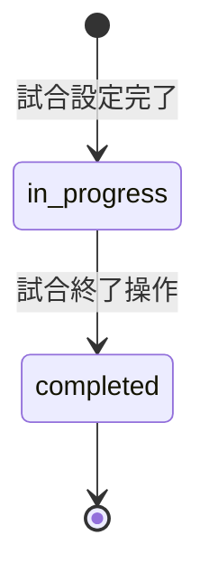

# プロジェクト用語集 (Glossary)

## 概要

このドキュメントは、野球スコアブックアプリで使用される用語の定義を管理します。
野球ドメイン用語・技術用語・データモデル用語・成績計算用語を統一的に定義します。

**更新日**: 2026-02-17

---

## ドメイン用語（野球）

### NPB
**定義**: 日本野球機構（Nippon Professional Baseball）

**説明**: 日本プロ野球を統括する組織。本アプリのスコアブックレイアウト・記号体系はNPBの標準フォーマットに準拠する。

**英語表記**: Nippon Professional Baseball Organization

---

### スコアブック
**定義**: 野球の試合における全プレイを記録するための帳票

**説明**: 打席ごとにダイヤモンド（菱形）が描かれたセルに、一球ごとの投球・打席結果・走者の動きを記号で記録する。本アプリはNPB準拠の日本式スコアブックをデジタルで再現する。

**関連用語**: 打席セル、ダイヤモンド、打席結果

**英語表記**: Score Book / Score Sheet

---

### 打席（だせき）
**定義**: 打者が打席に立ってから何らかの結果（アウト・安打・四球等）が出るまでの一連のプレイ

**説明**: 打数とは異なり、四球・死球・犠打・犠飛も打席に含まれる。データモデルでは `PlateAppearance` エンティティが対応する。

**関連用語**: 打数、打席結果、PlateAppearance

**英語表記**: Plate Appearance (PA)

---

### 打数（だすう）
**定義**: 打席数から四球・死球・犠打・犠飛を除いた数

**説明**: 打率計算の分母となる。打席に立っても四球・死球・犠打・犠飛の場合は打数に含まれない（NPBルール）。

**計算式**: `打数 = 打席数 - 四球 - 死球 - 犠打 - 犠飛`

**関連用語**: 打席、打率

**英語表記**: At-Bat (AB)

---

### ダイヤモンド
**定義**: スコアブックの打席セル中央に描かれる菱形。一塁・二塁・三塁・本塁の4つの塁を示す

**説明**: 走者の走路（塁間移動）をダイヤモンド上のパスで表現する。本アプリではSVGで描画する。

**関連用語**: 走者、塁間イベント

**英語表記**: Diamond

---

### 打席結果（だせきけっか）
**定義**: 打席が終了した時点での結果の種別

**説明**: NPBスコアブック準拠の記号で記録される。TypeScriptでは `PlateResult` 型として定義。

**種別**:
| 分類 | 結果 | 記号例 |
|------|------|------|
| 安打 | 単打・二塁打・三塁打・本塁打 | 1B / 2B / 3B / HR |
| アウト | ゴロ・フライ・ライナー | G / F / L |
| 三振 | 空振り三振・見逃し三振 | K / Kc |
| 出塁 | 四球・死球 | BB / HBP |
| その他 | 野選・エラー・併殺打・振り逃げ | FC / E / DP / KWP |

**英語表記**: Plate Result

---

### 打者一巡（だしゃいちじゅん）
**定義**: 同一打順の打者が2回以上打席に立つこと（1〜9番が一通り完了して同じ打順に戻ること）

**説明**: 本アプリでは `Lineup.cycle` フィールドで管理する。サイクル1が先発・サイクル2以降は打者一巡後の同打順を示す。

**関連用語**: Lineup、cycle

**英語表記**: Batting Order Cycle

---

### 投球カウント
**定義**: 現在の打席でのボール（B）・ストライク（S）・ファウル（F）の球数

**説明**: 一球ごとに `Pitch` エンティティとして記録する。カウントの表示順はNPB準拠で「B-S」形式。

**関連用語**: Pitch、PitchType

**英語表記**: Count (Balls-Strikes)

---

### 守備番号（しゅびばんごう）
**定義**: 各守備位置に割り当てられた番号（1〜9、および10=指名打者）

**説明**: スコアブックでのアウト・打球方向の記録に使用する。指名打者（DH）は守備につかないため打球方向には使用しない。

| 番号 | 守備位置 |
|------|---------|
| 1 | 投手 (Pitcher) |
| 2 | 捕手 (Catcher) |
| 3 | 一塁手 (First Base) |
| 4 | 二塁手 (Second Base) |
| 5 | 三塁手 (Third Base) |
| 6 | 遊撃手 (Shortstop) |
| 7 | 左翼手 (Left Field) |
| 8 | 中堅手 (Center Field) |
| 9 | 右翼手 (Right Field) |
| 10 | 指名打者 (Designated Hitter) |

**TypeScript型**: `FieldingPosition = 1 | 2 | 3 | 4 | 5 | 6 | 7 | 8 | 9 | 10`

---

### 塁間イベント（るいかんイベント）
**定義**: 打席中・打席後に発生する走者の移動・アウトに関するプレイ

**説明**: 盗塁・暴投・パスボール・ボーク・牽制アウト等。データモデルでは `BaseEvent` エンティティが対応する。

**種別**:
- `advance`: 通常進塁
- `stolen_base`: 盗塁
- `caught_stealing`: 盗塁死
- `wild_pitch`: 暴投
- `passed_ball`: パスボール
- `balk`: ボーク
- `pickoff`: 牽制アウト
- `out`: 一般的なアウト

**英語表記**: Base Running Event

---

### 選手交代
**定義**: 試合中に出場選手を交代すること

**説明**: 4種類の交代を記録できる。交代後の選手はLineupに追加され、以降の打席・投球成績はその選手に帰属する。

**種別**: 代打 / 代走 / 守備交代 / 投手交代

**関連用語**: Lineup、SubstitutionType

**英語表記**: Substitution

---

### Undo（アンドゥ）
**定義**: 直前のスコア入力操作を取り消す機能

**説明**: Zustand Storeのスナップショット履歴（`undoStack`）に基づいて状態を巻き戻す。ページリロードでUndo履歴はリセットされる（揮発性）。

**関連用語**: scoreStore、ScoreSnapshot

---

## 略語・頭字語（野球成績）

### AVG / 打率
**正式名称**: Batting Average

**計算式**: `打率 = 安打 / 打数`

**実装箇所**: `lib/stats/battingStats.ts`

---

### OBP / 出塁率
**正式名称**: On-Base Percentage

**計算式**: `出塁率 = (安打 + 四球 + 死球) / (打数 + 四球 + 死球 + 犠飛)`

**実装箇所**: `lib/stats/battingStats.ts`

---

### SLG / 長打率
**正式名称**: Slugging Percentage

**計算式**: `長打率 = (単打 + 二塁打×2 + 三塁打×3 + 本塁打×4) / 打数`

**実装箇所**: `lib/stats/battingStats.ts`

---

### OPS
**正式名称**: On-base Plus Slugging

**計算式**: `OPS = 出塁率 + 長打率`

**実装箇所**: `lib/stats/battingStats.ts`

---

### ERA / 防御率
**正式名称**: Earned Run Average（防御率）

**計算式**: `ERA = 自責点 / 投球回 × 9`

**実装箇所**: `lib/stats/pitchingStats.ts`

---

### WHIP
**正式名称**: Walks plus Hits per Inning Pitched

**計算式**: `WHIP = (与四球 + 被安打) / 投球回`

**実装箇所**: `lib/stats/pitchingStats.ts`

---

### K/9
**正式名称**: Strikeouts per 9 Innings

**計算式**: `K/9 = 奪三振 / 投球回 × 9`

**実装箇所**: `lib/stats/pitchingStats.ts`

---

### BB/9
**正式名称**: Walks per 9 Innings

**計算式**: `BB/9 = 与四球 / 投球回 × 9`

**実装箇所**: `lib/stats/pitchingStats.ts`

---

### K/BB
**正式名称**: Strikeout-to-Walk Ratio

**計算式**: `K/BB = 奪三振 / 与四球`

**実装箇所**: `lib/stats/pitchingStats.ts`

---

### HBP
**正式名称**: Hit By Pitch（死球）

**説明**: 打者が投球に当たって出塁すること。`PitchType` では `'hbp'` として記録する。

---

### RBI
**正式名称**: Runs Batted In（打点）

**説明**: 打者の打撃により得点した走者数。`PlateAppearance.rbi` フィールドに記録する。

---

## 技術用語

### Next.js App Router
**定義**: Next.js 13以降で導入されたファイルシステムベースのルーティングシステム

**本プロジェクトでの用途**: フロントエンドフレームワーク。Server Components・Client Components・Route Groupsを活用して画面を構成する。

**バージョン**: 15.x

**関連ドキュメント**: docs/architecture.md

---

### Supabase
**定義**: PostgreSQLベースのオープンソースFirebase代替BaaS（Backend as a Service）

**本プロジェクトでの用途**: データ永続化（PostgreSQL）・認証（Supabase Auth）・アクセス制御（Row Level Security）を一括提供する。

**バージョン**: @supabase/supabase-js 2.x

**関連ドキュメント**: docs/architecture.md

---

### Row Level Security（RLS）
**定義**: PostgreSQLのセキュリティ機能。テーブルの行ごとにアクセス制御ポリシーを設定できる

**本プロジェクトでの用途**: `auth.uid()` を使って、認証済みユーザーが自分の試合データ（`games`テーブルで `user_id = auth.uid()`）のみにアクセスできるようにする。

**関連コンポーネント**: `supabase/migrations/007_create_rls_policies.sql`

---

### Zustand
**定義**: React向けの軽量な状態管理ライブラリ

**本プロジェクトでの用途**: スコア入力状態・Undo履歴・ラインナップ状態をクライアントサイドで管理する。

**バージョン**: 5.x

**関連コンポーネント**: `store/scoreStore.ts`, `store/gameStore.ts`, `store/lineupStore.ts`

---

### Serwist
**定義**: Next.js向けのPWA（Service Worker）管理ライブラリ。WorkboxをベースにしたNext.jsインテグレーション

**本プロジェクトでの用途**: Service Workerの生成・キャッシュ戦略の設定・オフライン対応を実現する。

**バージョン**: 9.x

**関連ドキュメント**: docs/architecture.md

---

### PWA（Progressive Web App）
**定義**: Webアプリをネイティブアプリのように動作させる技術群（Service Worker・Web Manifest等）

**本プロジェクトでの用途**: 球場の不安定なネットワーク環境でも動作させるためオフライン対応を実装する。Serwistで実現。

---

### IndexedDB
**定義**: ブラウザ内の大容量Key-Valueストレージ。非同期APIでService Workerからもアクセス可能

**本プロジェクトでの用途**: オフライン中のスコア入力操作をキューとして保存し、オンライン復帰時にSupabaseへ同期する。

**関連コンポーネント**: `lib/sync/offlineSync.ts`

---

### shadcn/ui
**定義**: Radix UIベースのアクセシブルなReactコンポーネントライブラリ。コピー&ペースト方式でプロジェクトに組み込む

**本プロジェクトでの用途**: BottomSheet（入力パネル）・Dialog・Toast等のUIプリミティブとして活用する。

---

### Zod
**定義**: TypeScript向けのスキーマ検証ライブラリ

**本プロジェクトでの用途**: フォーム入力（チーム名・選手名・試合日等）のバリデーションと型安全なパース。

---

## アーキテクチャ用語

### Presentation Layer
**定義**: ユーザーインターフェースを担うレイヤー

**本プロジェクトでの適用**: `app/`（Next.js Pages）・`components/`・`hooks/`・Zustand Store が該当する。

**依存可能なレイヤー**: Application Layer

---

### Application Layer
**定義**: ビジネスロジックを担うレイヤー

**本プロジェクトでの適用**: `lib/stats/`（成績計算）・`lib/sync/`（同期ロジック）が該当する。

**依存可能なレイヤー**: Infrastructure Layer

---

### Infrastructure Layer
**定義**: データ永続化・外部通信を担うレイヤー

**本プロジェクトでの適用**: `lib/supabase/`（DB操作）・Service Worker・IndexedDB が該当する。

---

### 楽観的更新（Optimistic Update）
**定義**: サーバーのレスポンスを待たずに、UIの状態を先に更新する手法

**本プロジェクトでの適用**: スコア入力時にまずZustand Storeを更新し、バックグラウンドでSupabaseに保存する。失敗時はオフラインキューに積む。

---

### オフライン操作キュー
**定義**: ネットワーク切断中に発生した書き込み操作を順番に保存しておくキュー

**本プロジェクトでの適用**: `lib/sync/offlineSync.ts` がIndexedDBで管理する。オンライン復帰時に順次Supabaseへ送信する。

**関連コンポーネント**: `lib/sync/offlineSync.ts`, `hooks/useOfflineSync.ts`

---

## ステータス・状態

### GameStatus（試合ステータス）

| ステータス | 意味 | 遷移条件 |
|----------|------|---------|
| `in_progress` | 試合中 | 試合設定完了時の初期状態 |
| `completed` | 試合終了 | ユーザーが試合終了操作を行った時 |

---

### PitchType（投球種別）

| 値 | 意味 | スコアブック表記 |
|----|------|--------------|
| `ball` | ボール | B |
| `strike_swinging` | 空振りストライク | S |
| `strike_looking` | 見逃しストライク | S（※） |
| `foul` | ファウル | F |
| `in_play` | インプレー（打球） | — |
| `hbp` | 死球 | HBP |

---

### BasePosition（塁位置）

| 値 | 意味 |
|----|------|
| `0` | 打席（バッターボックス） |
| `1` | 一塁 |
| `2` | 二塁 |
| `3` | 三塁 |
| `4` | 本塁（得点） |

---

## データモデル用語

### Game（試合）
**定義**: 1試合を表すエンティティ

**主要フィールド**:
- `id`: UUID
- `userId`: 所有者（RLSの基準）
- `homeTeamName` / `awayTeamName`: チーム名
- `status`: `GameStatus`
- `date`: 試合日

**関連エンティティ**: Lineup, Inning

---

### Lineup（ラインナップ・選手登録）
**定義**: 試合における打順・守備位置・選手情報を管理するエンティティ

**主要フィールド**:
- `battingOrder`: 打順（1〜9）
- `cycle`: 打者一巡のサイクル（先発は1、打者一巡後の同打順は2以上）
- `position`: 守備番号（1〜9、10=指名打者）
- `substitutionType`: 交代種別（代打/代走/守備交代/投手交代）

**制約**: `gameId + side + battingOrder + cycle` の組み合わせが一意

---

### PlateAppearance（打席）
**定義**: 1打席を表すエンティティ

**主要フィールド**:
- `batterLineupId`: 打者のLineup ID
- `pitcherLineupId`: 投手のLineup ID
- `result`: 打席結果（`PlateResult`型）
- `hitDirection`: 打球方向（守備番号1〜9）
- `rbi`: 打点数

**関連エンティティ**: Pitch, BaseEvent

---

### Pitch（投球）
**定義**: 1球を表すエンティティ

**主要フィールド**:
- `plateAppearanceId`: 所属する打席
- `sequence`: 打席内の球数（1始まり）
- `type`: 球種（`PitchType`型）

---

### BaseEvent（塁間イベント）
**定義**: 走者の塁間移動・アウトを表すエンティティ

**主要フィールド**:
- `runnerLineupId`: 走者のLineup ID
- `fromBase` / `toBase`: 起点塁 / 到達塁（`BasePosition`型）
- `eventType`: イベント種別（`BaseEventType`型）

---

## 成績計算用語

### 投球回（とうきゅうかい）
**定義**: 投手が投球した回数。1/3回・2/3回単位で計算する

**計算式**: `投球回 = アウト数 / 3`

**表記例**: 5回1/3 → データ上は `5.333...` として管理

**実装箇所**: `lib/stats/pitchingStats.ts`

---

### 自責点（じせきてん）
**定義**: 投手の責任による失点。エラーや捕逸が絡まない形で発生した得点

**説明**: 本アプリではエラー記録（`PlateAppearance.errorFielder`）を参照して自責点を判定する。実装上は簡略化し、エラー無しの得点を自責点として扱う。

**関連用語**: ERA

**英語表記**: Earned Run (ER)

---

### スナップショット（Undo履歴）
**定義**: Undo機能のために保存するZustand Storeの状態のコピー

**説明**: 各スコア入力操作の前にスナップショットを `undoStack` 配列に積む。`undo()` 呼び出し時に最新スナップショットで状態を上書きする。

**型定義**: `ScoreSnapshot` (`store/scoreStore.ts`)

---

## 用語集管理ルール

- 新しいドメイン用語・技術用語を追加した場合は本ファイルを更新する
- 略語・頭字語は初出時に必ずフルスペルを記載する
- 用語の定義が変更された場合は関連するドキュメント（PRD・機能設計書等）も合わせて更新する
- 更新日を必ず更新する
